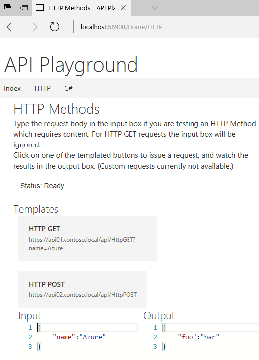
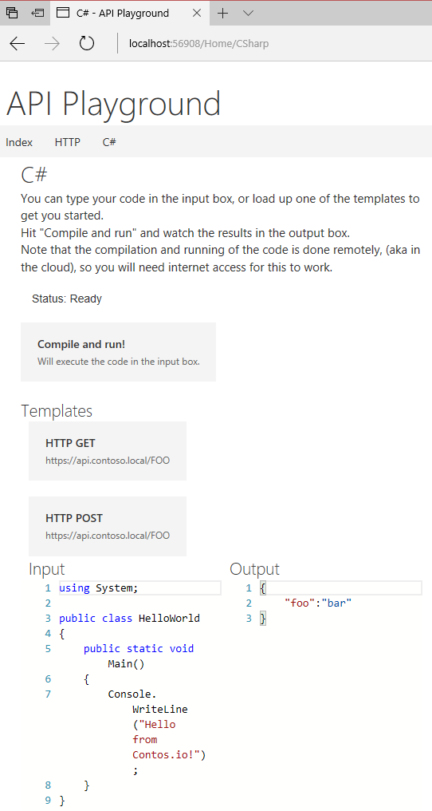

## API-Playground

### Description
This solution contains a utility web page for testing APIs. It is based on Visual Studio 2017 and .NET Core.

It currently provides two methods for testing APIs; HTTP method calls and "raw" code.

#### HTTP
This method works similar to SwaggerUI in which you get to choose which HTTP call to execute, but the actual implementation is abstracted away from you. Fairly easy if all you want to do is test the output of a given API.

Currently the only option is to create the templated buttons in HTML, and no custom calls are available directly in the UI. (Yes, it is sort of a poor man's Postman/Fiddler in this respect.)

#### C#
The more interesting option is using the option for specifying the actual code that will be used for calling into the APIs. There are templates for a generic GET or POST call which you can edit to your liking to create a more realistic test scenario.

Adding more templates currently requires you to add in a JavaScript function, and a button html tag, to load into the editor view. Slighly unflexible, but there is no actual templating system implemented yet.

#### Notes
The editor view is provided by using the Monaco-Editor: [https://github.com/Microsoft/monaco-editor](https://github.com/Microsoft/monaco-editor)

The compilation and running of the code requires internet access as it is sent to "the cloud" for execution. It does not run locally yet (working on that).
